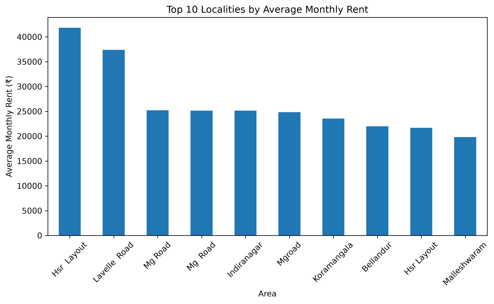
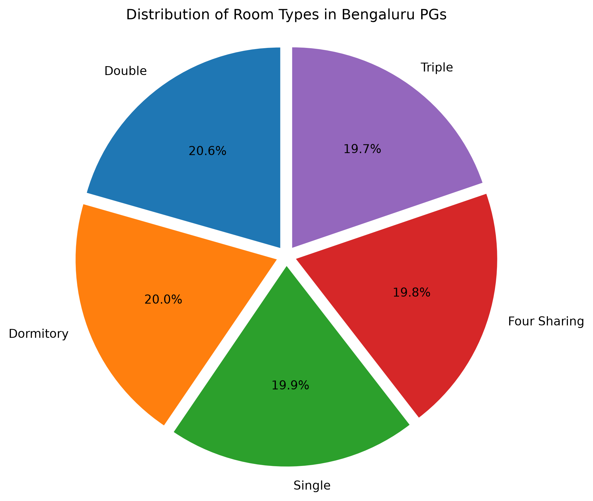
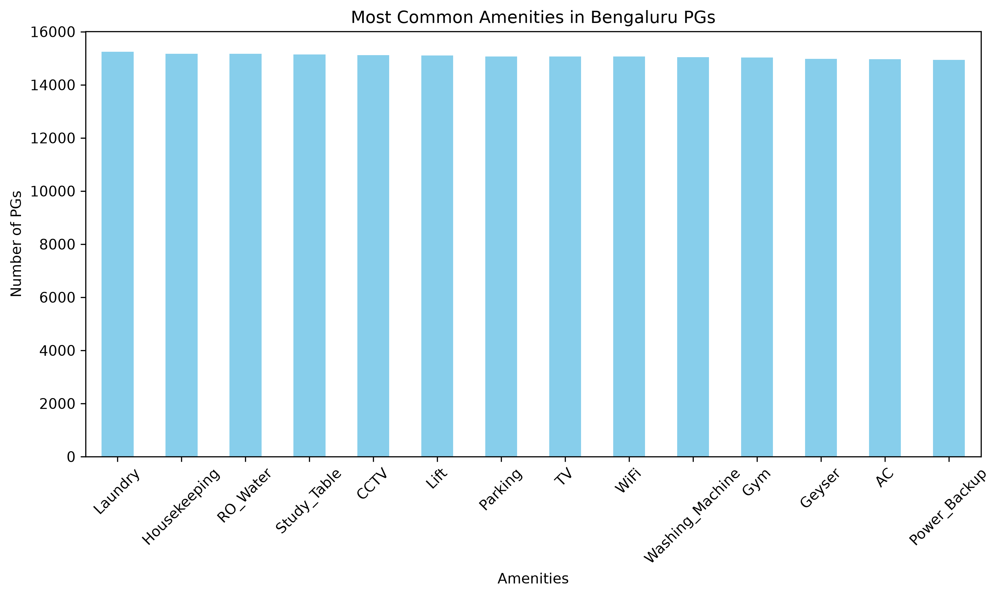
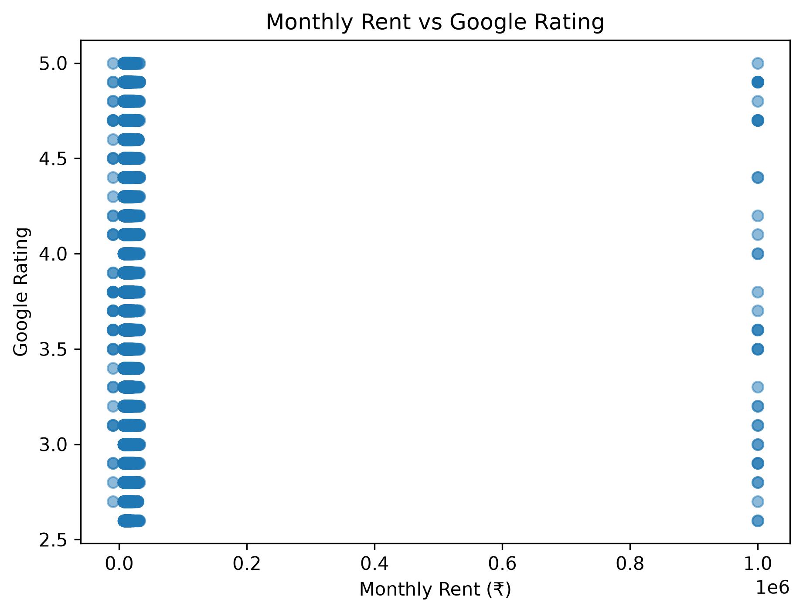

# 🏠 Bengaluru PG Market Intelligence: An End-to-End Data Analytics Project


---

# 📌 Project Overview

This project analyzes more than **30,000 Bengaluru Paying Guest (PG) listings** to uncover trends in rental pricing, room types, amenities, occupancy, customer ratings, and locality-wise market behavior.

The project demonstrates the complete data analytics workflow, including data cleaning, preprocessing, exploratory data analysis (EDA), data visualization, and business insight generation using Python.

---

# 🎯 Objectives

- Clean and preprocess the raw dataset.
- Handle missing values and duplicate records.
- Explore rental price trends.
- Analyze occupancy patterns.
- Study locality-wise pricing.
- Evaluate customer ratings.
- Generate business insights and recommendations.

---

# 📊 Dataset Information

| Attribute | Value |
|-----------|-------|
| Raw Records | 30,600 |
| Clean Records | 30,156 |
| Features | 40 |
| Localities | 116 |
| Business Questions | 15 |

---

# 🛠️ Technologies Used

- Python
- Pandas
- NumPy
- Matplotlib
- Seaborn
- Jupyter Notebook

---

# 📂 Repository Structure

```text
Bengaluru-PG-Market-Analysis
│
├── data
├── notebook
├── presentation
├── images
├── README.md
├── requirements.txt
├── LICENSE
└── .gitignore
```

---

# 🔄 Project Workflow

```text
Raw Dataset
      │
      ▼
Data Cleaning
      │
      ▼
Data Preprocessing
      │
      ▼
Exploratory Data Analysis
      │
      ▼
Data Visualization
      │
      ▼
Business Insights
      │
      ▼
Recommendations
```

---

# 📈 Business Questions

- Which locality has the highest average rent?
- Which room type is most common?
- Does paying higher rent guarantee better ratings?
- Which amenities are most common?
- How does occupancy vary across room types?
- Does metro proximity influence rent?
- Which localities have the highest-rated PGs?

---

# 💡 Key Insights

- HSR Layout has the highest average monthly rent.
- Rent has very weak correlation with Google ratings.
- Laundry is the most common amenity.
- Locality has a stronger impact on rent than metro proximity.
- Premium pricing does not always indicate better customer satisfaction.

---

# 💼 Business Recommendations

### For PG Owners

- Improve service quality along with pricing.
- Maintain transparent pricing policies.
- Promote premium amenities effectively.

### For Tenants

- Compare ratings and amenities before selecting a PG.
- Consider locality instead of relying only on rent.

### For Investors

- Focus on high-demand micro-markets.
- Monitor emerging localities with growing demand.

---

# 🚀 Future Scope

- Machine Learning based rent prediction.
- Interactive Power BI dashboard.
- Sentiment analysis of customer reviews.
- Recommendation system for PG selection.
- Real-time market monitoring.

---

# ▶️ Installation

```bash
git clone https://github.com/yourusername/Bengaluru-PG-Market-Analysis.git

cd Bengaluru-PG-Market-Analysis

pip install -r requirements.txt

jupyter notebook
```

---

# 👩‍💻 Author

**Mohit Mali**

B.Tech Computer Science Engineering

Tech Stack: Python | SQL | Power BI | Excel | Data Analytics

GitHub: *(https://github.com/mohitmali1110)*

LinkedIn: *(www.linkedin.com/in/mohit-mali27)*

---

⭐ If you found this project useful, consider giving it a star.
---

# 📊 Project Visualizations

### Average Rent Analysis



### Highest Rent Localities


### Room Type Distribution



### Amenities Distribution



### Google Rating Analysis


